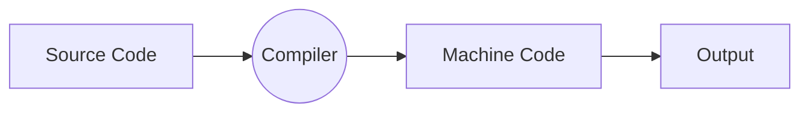
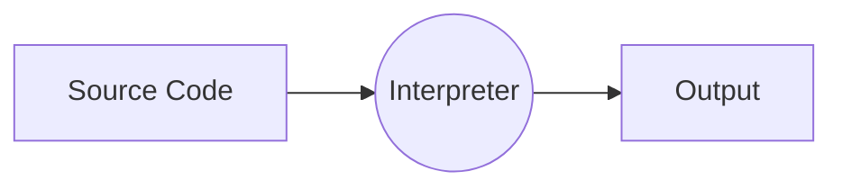
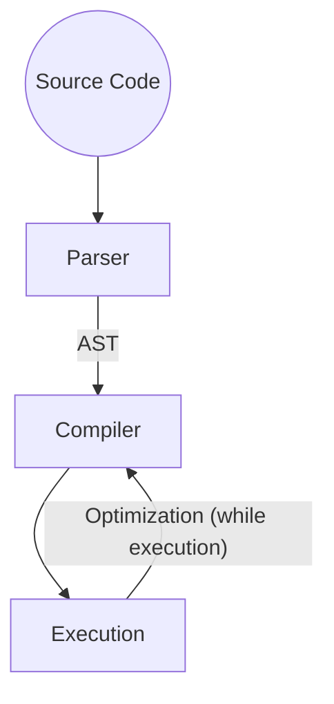

## Overview of JavaScript

JavaScript is a
* High Level,
* Prototype based object oriented,
* Multi-paradigm,
* Interpreted / Just in time compiled,
* Dynamic,
* Single threaded,
* Garbage collected
programming language with first class functions and a non-blocking event loop concurrency model.

**High Level:** Which could be easily understood by the humans and computer. In low level languages user has to manage memory manually.

**Garbage Collected:** Low-level languages like C, have manual memory management primitives such as `malloc` and `free()`. In contrast, JavaScript automatically allocates memory when objects are created and frees it when they are not used anymore.

**Interpreted / Just in time compiled:** An interpreted language is a programming language whose implementations execute instructions directly and freely, without previously compiling a program into machine-language instructions. JavaScript is commonly thought of as an interpreted language, it is actually a Just-In-Time compiled language. Modern JavaScript engines use a JIT compiler to optimize the code for execution.

Compiler Working


Note: Here the machine code is portable.

Interpreter Working


Note: 
1. Code still needs to be converted to machine code. (JIT)
2. Here the machine code generated is not portable. (JIT)

**Multi-paradigm:** A paradigm is an approach of structuring the code. There are three paradigm: 
1. Procedural programming
2. Object oriented programming
3. Functional programming

**Procedural programming** is the conventional method of programming in which a program is structured as a series of instructions. It focuses on data-processing procedures or routines. Data and functions are regarded as distinct entities in procedural programming. The languages C, Pascal, and Fortran adhere to this paradigm.

**Object-oriented programming** is a programming paradigm that organizes a program around instances of classes called objects. It emphasizes data and behavior encapsulation within objects, thereby fostering code reuse and modularity. Included among the OOP languages are Java, C++, and Python.

**Functional Programming** is a paradigm that evaluates mathematical functions to perform computation. It emphasizes immutability, pure functions, and side-effect avoidance. Haskell, Lisp, and Erlang are languages that adhere to the functional programming paradigm.
A **Pure Function** is a function (a block of code) that **always returns the same result if the same arguments are passed**.  It does not depend on any state or data change during a program’s execution.

**Prototype based object oriented:**  JavaScript is a prototype-based, object-oriented language and **uses prototypal inheritance instead of classical inheritance**. Simply put, JavaScript does not have classes, it has prototype objects cloned to produce new objects. Classes are only syntactic sugar for prototypes.

**First class functions:** A programming language is said to have First-class functions **if functions in that language are treated like other variables**. So the functions can be assigned to any other variable or passed as an argument or can be returned by another function.

**Dynamic:** JS is dynamically typed language. The interpreter assigns variables a type at runtime based on the variable's value at the time.

## JS Engine

JS Engine is a program which runs JS code. It contains **Heaps and Call Stack.**

Modern Just in Time Compiler Working:


Parser - Reads line by line the source code. Abstract Syntax Tree (AST) is constructed.
Execution happens in JS Engine Call Stack.

## JS Runtime

It is a container including all the things that we need to use JS.
It contains
1. JS Engine (heap and call stack)
2. Web API's (not a part of JS) - Provided by browsers.
3. Callback queue (every element in the queue is taken to the call stack for execution called event loop).

## How JS Code Executed

1. After compilation, the code is brought for the execution. The JS code always runs in a **Execution Context**. It is a environment where JS code executed.
2. **Global Execution Context** for top level code is created. (top level code which are not inside any functions).
3. There is only one Global Execution Context (top level code).
4. The top level code are executed first.
5. Next the functions are executed and waits for callbacks.
6. One Execution Context per function created.
7. All that makes a **Call Stack**.
8. Execution Context are stacked in call stack and executed one by one.

## Scope and Scope Chain

**Scoping**: How our programs variables are organized and accessed.
**Lexical Scoping**: Scoping is controlled by placement of functions and blocks in the code.
**Scope**: Space in which a certain variable is declared.

Three types of scope:
1. Global Scope
2. Function Scope
3. Block Scope (ES6)

==Note:== `let` and `const` are block scoped where as `var` is function scoped.

## Hoisting

Make some special type of variables accessible / usable in the code before they are actually declared


|                                 |             **Hoisted?**              |            **Initial Value**            | **Scope** |
| ------------------------------- | :-----------------------------------: | :-------------------------------------: | :-------: |
| Function Declaration            |                  YES                  |             Actual function             |   Block   |
| var varibales                   |                  YES                  |       undefined (weird behaviour)       | Function  |
| let and const variables         |                  NO                   | uninitialized, Temporal Dead Zone (TDZ) |   Block   |
| function expressions and arrows | Depends if using var or let and const |                                         |           |
**Temporal Dead Zone**

```js
if(......){
   console.log(job)    // Cannot access job before initialization. (TDZ)
   const job = "Professor";
}
```

**Hoisting Example**

```js
console.log(firstName); // undefined
console.log(lastName); // Cannot access 'lastName' before initialization

var firstName = 'Sandeep';
let lastName = 'Dewangan';
```

## `this` keyword

* Special variable created for every execution context (function). It points to the owner of the function.
* Values is not static, depends on how the function is called.
* Arrow function doesn't have their own `this`.

Global this keyword

```js
console.log(this); // displays the window object
```

Regular function call

```js
const calAge = function (birthYear) {
  console.log(this); // undefined
};
calAge(1990);
```

Arrow function

```js
const calAgeArrow = (birthYear) => {
  console.log(this); // displays the window object
};
calAgeArrow(1990);
```

Object

```js
const sandeep = {
  year: 1990,
  calAge: function () {
    console.log(this);
  },
};
sandeep.calAge(); // {year: 1990, calAge: ƒ}
```

Another object / object borrowing

```js
const sandeep = {
  year: 1990,
  calAge: function () {
    console.log(this);
  },
};
sandeep.calAge(); // {year: 1990, calAge: ƒ}

// Another object

const khushbu = {
  year: 1996,
};

// method borrowing
khushbu.calAge = sandeep.calAge;
khushbu.calAge(); // {year: 1996, calAge: ƒ}

// another function
const f = sandeep.calAge;
f(); //undefined
```

## Regular Vs Arrow Functions

**Problem**

```js
// Problem
const sandeep = {
  year: 1990,
  func1: function () {
    console.log(this); // {year: 1990, func1: ƒ}
    const func2 = function () {
      console.log(this); // undefined, bez this is a regular function call
    };
    func2();
  },
};
sandeep.func1();
```

**Solution **

```js
const sandeep = {
  year: 1990,
  func1: function () {
    const self = this;
    console.log(self); // {year: 1990, func1: ƒ}
    const func2 = function () {
      console.log(self); // {year: 1990, func1: ƒ}
    };
    func2();
  },
};
sandeep.func1();
```

## Some of the Glitches in JS

Primitives data types are stored into the stack, while objects are stored into the heaps.

**Problem:**

```js
const sandeep = {
  age: 34,
};
// const variable can be changed in case of objects but not in case of primitive dt.
const khushbu = sandeep; // reference 
khushbu.age = 27;
console.log(sandeep); // {age: 27}
console.log(khushbu); // {age: 27}
```

**Solution: Copy Objects**

```js
const sandeep = {
  age: 34,
};
// copy all the properties of sandeep to khushbu
const khushbu = Object.assign({}, sandeep);
khushbu.age = 27;
console.log(sandeep); // {age: 34}
console.log(khushbu); // {age: 27}
```
