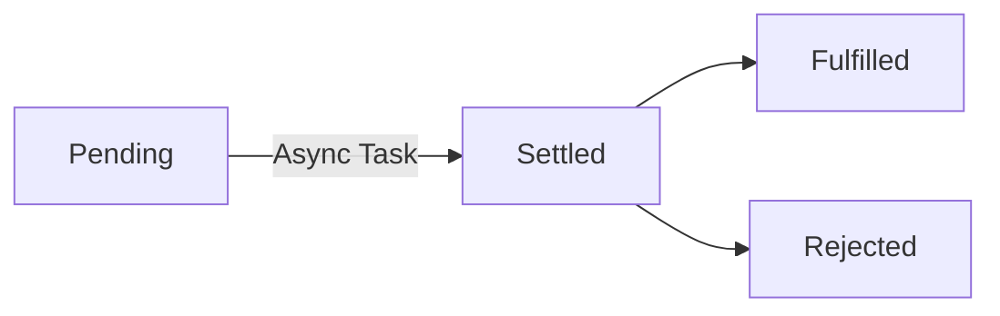

Synchronous execute code line by line. User has to wait for next instruction to run.
Synchronous code is blocking.

Asynchronous code is non-blocking. 

AJAX - Asynchronous JavaScript and XML, allows to communicate with webservers in an asynchronous way.

## Traditional Ajax Call 

```js
// html elements
const countriesArea = document.querySelector('.countries_area');

// Ajax request - traditional way
// public api - https://github.com/public-apis/public-apis
// https://restcountries.com/v3.1/name/india
const request = new XMLHttpRequest();
request.open('GET', 'https://restcountries.com/v3.1/name/india');
request.send();

request.addEventListener('load', function () {
  // parse data
  // [data] destructuring
  const [data] = JSON.parse(this.responseText);

  const html = `
        <div>
          
          <h3>${data.name.common}</h3>
          <p>${data.currencies.INR.symbol} ${data.currencies.INR.name}</p>
          <p>${data.capital[0]}</p>
        </div>
  `;
  countriesArea.insertAdjacentHTML('beforeend', html);
});
```

## Modern Ajax Call

Promise - Future result of async operations.



```js
const getCountryData = function (country) {
  fetch(`https://restcountries.com/v3.1/name/${country}`)
    .then((res) => res.json())
    .then((data) => console.log(data));
};

getCountryData('india');
```

## Chaining Promises

```js
const getCountryData = function (country) {
  fetch(`https://restcountries.com/v3.1/name/${country}`)
    .then((res) => res.json())
    .then((data) => {
      // render country first
      renderCountry(data[0]);
      // get neighbouring country
      console.log(data[0].borders);
      data[0].borders.forEach((country, index) => {
        fetch(`https://restcountries.com/v3.1/alpha/${country.toLowerCase()}`)
          .then((res) => res.json())
          .then((data) => {
            renderCountry(data[0]);
          });
      });
    });
};

getCountryData('india');
```

## Handling Rejected Promises

**Handling Error**

```js

const getCountryData = function (country) {
  fetch(`https://restcountries.com/v3.1/name/${country}`)
    .then(
      (res) => res.json(),
      (err) => console.log(err)
    )
    .then((data) => {
      // render country first
      renderCountry(data[0]);
      // get neighbouring country
      fetch(`https://restcountries.com/v3.1/alpha/bgd`)
        .then(
          (res) => res.json(),
          (err) => console.log(err)
        )
        .then((data) => {
          renderCountry(data[0]);
        });
    })
    .catch((err) => console.log(err))
    .finally((err) => console.log('Always called...'));
};

getCountryData('india');
```

## Throwing Errors Manually

256. Throwing Errors Manually

## Building and Consuming Simple Promise

```js
// building
const lotteryPromise = new Promise(function (resolve, reject) {
  console.log('Lottery opening is in progress...');
  setTimeout(function () {
    if (Math.random() >= 0.5) {
      resolve('Congratulations you have won lottery...');
    } else {
      reject(new Error('Sorry try again...'));
    }
  }, 2000);
});

// consuming
lotteryPromise
  .then((res) => console.log(res))
  .catch((err) => console.error(err));
```

## Promise and Catching Error using ES6

```js
// html elements
const countriesArea = document.querySelector('.countries_area');

const getCountryData = async function (country) {
  try {
    // Fetch country data
    const res = await fetch(`https://restcountries.com/v3.1/name/${country}`);
    const data = await res.json();
    console.log(data);
    // Populate HTML for first country
    const html = `
  <div>
    
    <h3>${data[0].name.common}</h3>
    <p>${data[0].capital[0]}</p>
  </div>
`;
    countriesArea.insertAdjacentHTML('beforeend', html);
  } catch (err) {
    console.log(err);
  }
};

getCountryData('india');
```

## Sequential Promise

```js
const getThreeCountryDataSerial = async function (c1, c2, c3) {
  try {
    const res1 = await fetch(`https://restcountries.com/v3.1/name/${c1}`);
    const res2 = await fetch(`https://restcountries.com/v3.1/name/${c2}`);
    const res3 = await fetch(`https://restcountries.com/v3.1/name/${c3}`);
  } catch (e) {
    console.log(e);
  }
};
// check the waterfall chart of browser under network tab.
// we can see that the api calls are sequential.
getThreeCountryDataSerial('india', 'usa', 'pakisthan');
```

## Parallel Promise

```js
const getThreeCountryDataSerial = async function (c1, c2, c3) {
  try {
    const data = await Promise.all([
      fetch(`https://restcountries.com/v3.1/name/${c1}`),
      fetch(`https://restcountries.com/v3.1/name/${c2}`),
      fetch(`https://restcountries.com/v3.1/name/${c3}`),
    ]);
  } catch (e) {
    console.log(e);
  }
};
// check the waterfall chart of browser under network tab.
// we can see that the api calls are in parallel.
getThreeCountryDataSerial('india', 'usa', 'pakisthan');
```
